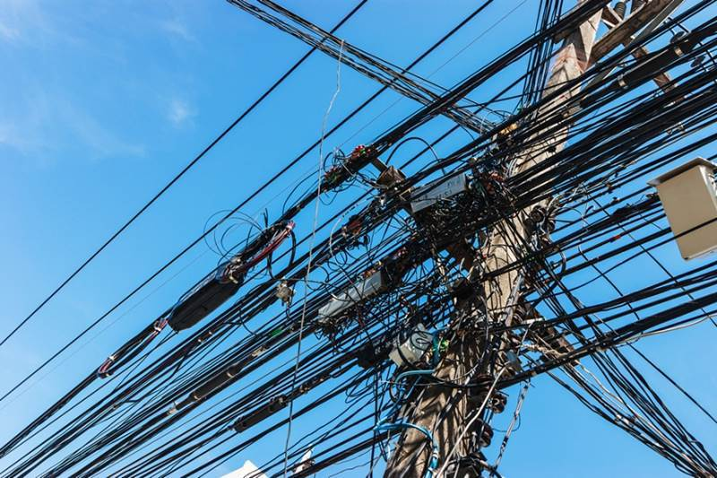
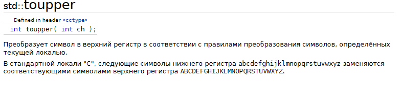
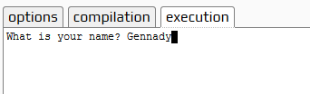
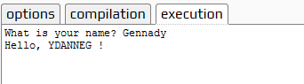
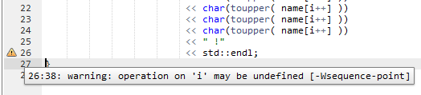
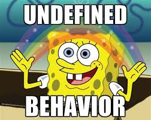
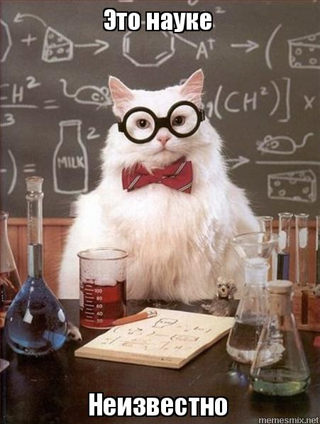

<!-- $theme: gaia -->
<!-- page_number: true -->

C++ для новичков.
=====================
<div align="center">

Путь камикадзе
</div>

---
### Путь камикадзе
<div align="center">


Мы тоже немного пилоты
@supapro
</div>

---
# Все хотят изучать С++
* Ну, может быть и не все...
* Но почти каждый день появляются новые и новые люди, желающие изучить С++.
* Иногда они хотят писать быстрые программы
* Иногда они хотят создавать ИИ
* Иногда они хотят на самом деле изучать _**чистый С**_, но не знают об этом, потому что отделить одно от другого сложно для новичка.

### Но что же их привлекает?

---
### Привлекательность С/С++
### С и С++ очень распространены.
<span style="font-size:26px">

* Почти все базовые компоненты и службы всех вычислительных систем написаны на С или С++
	* все операционные системы
	* все СУБД
	* все базовые компоненты WEB
	* все сетевые службы, сетевые устройства

---
### Привлекательность С/С++
* Также на С/С++ написаны
	* множество игр и игровых "движков"
	* библиотеки AI и машинного обучения 
	* библиотеки распознавания текста, речи
	* библиотеки обработки изображения
	* ПО банков и платёжных систем
	* Криптографическое ПО
	* Криптовалюты

---
### С и С++ применяются для создания ПО с высокой производительностью
#### Что же лучше? С или С++?
<span style="font-size:26px">

* С -- довольно слабый, неудобный язык, не обладающий большой мощностью и выразительностью.
* С++ обладает всеми сильными сторонами С, но даёт большее.
* Линус Торвальдс полагает, что С лучше
* Мы уважаем его выбор, но конечно с ним не согласны. <div align="center"></div>

---
#### Всё это делает С++ привлекательным языком
<span style="font-size:20px">
(в глазах начинающих)
</span>
<div align="center">

<p style="color:red">Изучу его - буду богом!</p>
</div>
	
---
###### Кто и зачем изучает С/С++
<span style="font-size:20px">


* Студенты ВУЗ, СТО
	- заинтересованные (33% от студентов)
	- в силу наличия в программе (66% от студентов)
* Специалисты
	- расширение знаний и навыков (второй язык)
	- переквалификация (падение спроса на основное направление либо скука)
* Непрофессионалы
	- "а вот я хочу"
	- "чудики"
#### Но какой результат можно ожидать от изучения С++?

---
#### Сложный ли С++ язык?
<span style="font-size:26px">


* Да! Очень сложный!

---
#### Почему С++ такой сложный?
<span style="font-size:20px">


##### С++ является одним из самых сложных из существующих языков программирования.
* С++ базируется на С. Сохраняет обратную совместимость.
	```Общяя история двух родственных языков составляет почти 50 лет!```
* С++ - гибридный язык с поддержкой различных парадигм программирования.
* С++ стандартизирован, есть много реализаций-компиляторов, каждый со своими расширениями.
* С++ переносим, но на каждой платформе есть своя специфика. 
* Программа на С/С++ не обязана быть даже целиком валидной с точки зрения языка, но может при этом работать.
---
#### Почему С++ такой сложный?


##### Внутри С++ содержится как минимум несколько языков по различию в подходах
<span style="font-size:23px">

* Чистый С
* С с классами (С++ до 98го)
* С++ с шаблонами и обобщённым программированием
* С++ с метапрограмами из 2000-ных
* Функциональный С++11
* Современный С++17/20

---
#### Почему С++ такой сложный?


##### Документация на С++ огромна.
<span style="font-size:23px">

|Год|Объём спецификации языка|
|:-:|:-:|
|1990|453 стр|
|1998|776 стр|
|C++11|1353 стр|
|C++14|1370 стр|
|C++17| стр| 

---
#### С чего начинается знакомство с любым языком программирования?

<span style="font-size:27px">

* Принципы функционирования программы (90% Машина Тьюринга)
* Типы данных языка
* Операторы и управляющие конструкции языка
* Системы сборки, поставки и развёртывания

```Работа с каждым языком начинаеся с Hello World!```

---
### Пишем HELLOWORLD на С++

<span style="font-size:23px">

* http://cpp.sh/

```
#include <iostream>
#include <string>

int main()
{
  std::string name;
  std::cout << "What is your name? ";
  getline (std::cin, name);
  std::cout << "Welcome to C++, " << name << "!\n";
}
```

Просто и понятно.
Но хочется большего.

---
### Пишем HELLOWORLD на С++

<span style="font-size:23px">


```
#include <iostream>
#include <string>

int main()
{
  std::string name;
  std::cout << "What is your name? ";
  getline (std::cin, name);
  std::cout << "Welcome to C++, " << name << "!\n"; <<=== Хотим имя БОЛЬШИМИ буквами!
}
```
* Ищем функцию ...
<div align="center">

</div>
*Класс! сейчас сделаем!

---
##### Пишем HELLOWORLD на С++

<span style="font-size:20px">

```
#include <iostream>
#include <string>
#include <cctype>

int main()
{
  std::string name;
  std::cout << "What is your name? ";
  getline (std::cin, name);
  int i = 0;
  std::cout << "Hello, " << char(toupper( name[i++] )) 
                         << char(toupper( name[i++] )) 
                         << char(toupper( name[i++] ))
                         << char(toupper( name[i++] ))
                         << " !"
                         << std::endl;
}
```

---
##### Пишем HELLOWORLD на С++

<span style="font-size:20px">

```
#include <iostream>
#include <string>
#include <cctype>

int main()
{
  std::string name;
  std::cout << "What is your name? ";
  getline (std::cin, name);
  int i = 0;
  std::cout << "Hello, " << char(toupper( name[i++] )) 
                         << char(toupper( name[i++] )) 
                         << char(toupper( name[i++] ))
                         << char(toupper( name[i++] ))
                         << char(toupper( name[i++] ))
                         << char(toupper( name[i++] ))
                         << char(toupper( name[i++] ))
                         << char(toupper( name[i++] ))
                         << char(toupper( name[i++] ))
                         << char(toupper( name[i++] ))
                         << char(toupper( name[i++] ))
                         << char(toupper( name[i++] ))
                         << char(toupper( name[i++] ))
                         << " !"
                         << std::endl;

}
```

---
### Первый прогон!
<div align="center">

</div>

---
### Первый прогон!
<div align="center">

</div>

---
### Первый прогон!
<div align="center">

</div>

---
### Первый прогон!
<div align="center">

</div>

---
#### Главный принцип работы программы С++
<div align="center">

</div>

##### Неопределённое поведение.
<span style="font-size:23px">

---
#### Когда это случилось?
##### Не было ничего сложного!
* ни сложных, многофайловых проектов
* ни безумных конструкций препроцессора
* ни сложных математических опрераций
* ни адского темплейтного метапрограммирования
	* ЭТО ВООБЩЕ ДЕТСКИЙ КОД! 
* такое можно было бы писать в школе!

---
### Неопределённое поведение.
<span style="font-size:23px">

#### Что же это такое?
* Что говорит стандарт ANSI/ISO?

``` text
1.3.24 undefined behavior 
behavior for which this International Standard imposes no requirements
```
вроде не страшно...
* Что говорит cpprefecence?
``` text
Renders the entire program meaningless if certain rules of the language are violated.
```
* Так что, вся моя программа неправильная?

---
### Неопределённое поведение.
<span style="font-size:30px">

#### Что же это такое?

_undefined behavior_ - there are **no restrictions on the behavior of the program**. Compilers are **not required to diagnose undefined behavior** (although many simple situations are diagnosed), and the compiled program is **not required to do anything meaningful**. 

---
### Самый главный слайд.
<span style="font-size:38px">

#### UB значит

* Неизвестность
* Помощи не будет !
* Ты один, а вокруг опасность!
<div align="center">

</div>

---
### Типы данных
<span style="font-size:25px">

Предположим, вы не испупгались UB...

Какие типы данных в распоряжении программиста С/С++?
Давайте разбираться...

---
#### Классификация типов 
<span style="font-size:20px">

* fundamental types: 
	* тип void
	* тип std::nullptr_t 
	* арифметические типы
		* типы с плавающей точкой (float, double, long double) 
      	* целочисленные типы 
        	* тип bool;
            * символьные типы: 
            	* короткие символьные типы (char, signed char, unsigned char);
               	* широкие символьные типы (char16_t, char32_t, wchar_t); 
			* знаковые целые типы (short int, int, long int, long long int);
            * беззнаковые целые типы (unsigned short int, unsigned int, unsigned long int, unsigned long long int); 

    * Составные типы 
    * ...

---
### Пишем toupper на C++
<span style="font-size:27px">

```
#include <iostream>
#include <string>
#include <cstring>

int main(int argc, char *argv[])
{
    std::string s;
    std::cout << "Input some strings\n";
    getline (std::cin, s);    
    for(unsigned c = 0; c < s.size(); ++c)
    {
        if( s[c] == ' ')
          std::cout << s[c];
        else
          std::cout << char(s[c] - ('a' - 'A'));
    }
    std::cout << "\n";
}
```
* Запускаем!

---
### Запускаем toupper на C++
```text
Input some strings
the quick brown fox jumps over a lazy dog
THE QUICK BROWN FOX JUMPS OVER A LAZY DOG
```

* Всё хорошо?

---
#### Классификация типов 
<span style="font-size:20px">

* fundamental types: 
	* арифметические типы
      	* целочисленные типы 
            * **символьные типы**:
            	* char
<div align="center">

</div>      

---
#### Классификация типов 
<span style="font-size:27px">

##### На самом деле 
* в С и С++ нет типов данных для поддержки символов.
	```text
    есть элементарные функции для классификации и тривиальных 
    преобразований символов в рамах кодировки ASCII (т.н. Latin-1)
    и библиотеки операционных систем и специализированные для 
    работы с текстом, не входящие в стандарт.
    char, char16_t, char32_t, wchar_t -- это просто числа
    ```
* wchar_t - вроде бы по описанию, символ Unicode?
	```text
    Нет, в С++ и С вообще нет встроенной поддержки Unicode, и она 
    не появится ранее 20 или даже 23 го года.
    ```
* Вы ещё хотите писать обработку тектов на С++?    
            	
---
#### Типы данных в С++
<span style="font-size:27px">

##### Ничего не забыли?
* А где же строки символов, текст?
	```text
    В С и С++ нет поддержки строк символов на уровне языка.
    ```
* Вместо поддержки строкового типа в С и С++ есть представления данных и (в С++) специальный класс, входящие в стандартные библиотеки, и реализующие работу с текстом.

Вы ещё хотите писать обработку тектов на С++?  
    
---
#### Типы данных в С++
<span style="font-size:27px">

##### Ничего не забыли?
* ок, а даты, время ? Такие важные структуры данных, где они?
	```text
    В С++ и С нет встроенной поддержки типов данных "дата", "время"
    и нет операций с ними
    ```
* Поддержки типов "дата" и "время" реализованы
	* в С в стандартной библиотеке языка как структура особого вида и несколько функций для работы с ней.
	* С++ в стандартной библиотеке поддержка интервальных данных появилась только в 2011 году. 
	* Поддержки дат, календарей в С++ нет до сих пор

---
#### Сборка программ
<span style="font-size:27px">

###### Ну, ладно, живут же как-то люди с этим.
### А как же нам собирать нашу программу?
<div align="center">

</div>

* Как из исходного текстового файла получить работающую программу?

---
#### Как из исходного текстового файла получить работающую программу?

<div align="center">

</div>

* (Это не шутка)

---
#### Как из исходного текстового файла получить работающую программу?
* Стандарт языка совсем не описывает процесс получения исполняемой программы из исходного кода
* Описывается только 9-тифазный процесс преобразования
* При этом применяется так называемая раздельная компиляция.

---
#### Раздельная компиляция
###### Среди компилируемых языков есть два противоположных подхода
<span style="font-size:22px">

* **Паскаль**:
	* один большой файл с исходным кодом.
	* компиляция в один шаг с получением исполняемого приложения
* **Фортран/С/С++**
	* много файлов с исходным кодом
	* компиляция каждого файла в промежуточный объектный код (полумашинный)
	* сборка из нескольких файлов объектного кода исполняемого приложения
	* при определённых условиях допустима сборка объектных модулей, полученных из исходных кодов, написанных на разных языках программирования.

---
#### Раздельная компиляция - проблемы
###### Главный бич начинающих при сборке
<span style="font-size:27px">

* При сборке начинающих поджидают две главные проблемы
	* Undefined Reference
		* Это когда что-то не определено
	* Нарушение ODR (One Definition Rule)
		* Это когда что-то определено несколько раз или по-разному

---
#### Раздельная компиляция - проблемы
<span style="font-size:27px">

* Не смотря на очевидность UR и ODRV, очень сложно объяснить начинающему что же у него не так в программе.
* Отсутствие определённого процесса сборки не позволяет дать совет о том, как собирать программу на другой платформе.
* В будущем в стандарте 2020 ожидается введение модулей исходных кодов, которые должны были бы исправить проблему, но сделают всё ещё хуже:
	* код будет написан 2мя способами, по-старому и по-новому.
	* простоты и изящности это не добавит

---
## Надежда есть!
<div align="center">

</div>

Да-да!

---
## Надежда есть! Но... Посчитаем!
<div align="center">

</div>

<span style="font-size:25px">

##### Вероятность успеха по категориям изучающих
* Студенты 
	- у 33%, которым надо знать, а не сдать, вероятность высокая. (скажем, тоже 33%)
	- у 66%, которым надо только сдать, вероятность близка к нулю
* Специалисты
	- высокая вероятность успеха
* Непрофессионалы
	- вероятность успеха - ноль.

---
## Мы спасём вас!

<div align="center">

</div>

---
### С++ -- не первый язык!
<span style="font-size:30px">

* Если вы не гений, и не собираетесь стать профессиональным разработчиком ПО, не изучайте С++.

Изучение С++ как первого языка программирования слишком сложно и бесполезно, если вы не собираетесь этим профессионально заниматься.

<div align="center">

</div>

---
## С++ -- не первый язык!
<span style="font-size:40px">

* Непрофессионалам нечего делать среди С++ разработчиков.
* Студентам лучше избегать изучения С++, если они не планируют заниматься разработкой ПО

---
## Если всё же надо изучать С++
<span style="font-size:27px">

#### Принцип постепенного усложнения. 

* Не торопиться. Не гнать вперёд. Не пытаться сделать всё и сразу.
* Начинать с классических консольных приложений
* Изучать язык, а не операционную системы, в которой он работает
* Изучать язык, а не библиотеки для него. 
* Да, будет не так эффектно

<div align="right">

</div>

---
#### Принцип постепенного усложнения. 
<span style="font-size:27px">

<div align="center">

</div>

---
#### Принцип постепенного усложнения. 
<span style="font-size:27px">

* Приложения можно разделить на 
	* консольные/терминальные
	* сервисы/демоны
	* встраиваемые/прошивки
	* приложения GUI
	* сайты / WEB
	* игры 2D/3D
* Желательно учится разрабатывать приложения именно в таком порядке.

это примерный порядок возрастания сложности и уменьшения роли С++ в этом

---
## Мы спасём вас!
<span style="font-size:24px">

### Не изучать устаревшее.
<div align="center">

</div>

* C++ развивается и одни возможности приходят на смену другим.
* Нужно изучать новые которые пришли на смену старым
* Это сложно сделать новичкам, потому что они не знают, что устарело, а что нет.

---
## Мы спасём вас!
<span style="font-size:20px">

### Не делать того, что не понимаешь.

<div align="center">

</div>

* На С++ очень важно вникать в то, что пишешь в программе, понимать каждую строку, каждый символ
* Если ты делаешь это, ты учишься
* Если ты не делаешь это, ты ходишь по 10 раз по одним и тем же граблям.

---
## Мы спасём вас!
<span style="font-size:27px">

### Проверять каждую строчку!

<div align="center">

</div>

* Очень много ошибок у начинающих по невнимательности.
* Надо проверять код.

---
## Мы спасём вас!
<span style="font-size:22px">

### Проверять каждую строчку!

<div align="center">

</div>

#### Очень много ошибок при неправильном использовании библиотечных функций.
* Надо тщательно читать документацию на функции.
	* что функция делает
	* в каких условиях работает, а когда не может работать 
	* что принимает и что возвращает
	* как сигнализирует об ошибках
* Надо обрабатывать все ошибки вызова фукнции.
* Надо проверять код, как в результате всё получилось.

---
### Проверять каждую строчку!
<div align="left">

</div>

#### Инструменты для выявления ошибок.

<span style="font-size:24px">

* Старая добрая отладочная печать.
	* После каждого ввода данных очень хорошо их тут же распечатать, чтобы выявить ошибки ввода.
	* В важных местах работы программы можно распечатать промежуточные итоги.
* **assert** -- встроенные проверки на правильность.
* Отладчики и пошаговое выполнение.
* Статические анализаторы кода (в том числе в IDE)

---
### Подводим итоги ...
<span style="font-size:24px">

* C++ не подходит для изучения программирования. Нужен другой язык
	* python
	* D или Rust? Может Fortran?
	* пока нет 100%-ных рецептов
* C++ только для профессионального использования.
* Если ты не собираешься его использовать, изучать его бессмысленно
* При необходимости изучать С++ нельзя торопиться
	* Наскоком не получится
    * Постепенно увеличивать сложность приложений.
    * Сначала -- только обработка данных 
	* Не изучать устаревшие части языка.
	* Внимательно писать код
  	
---
Литература и ссылки
===========================================
* https://ru.cppreference.com
* https://github.com/CppCon/CppCon2017
* https://isocpp.org/blog
* https://habr.com/ru/post/141080/ - Об assert
* https://github.com/masterziv/meetup.git
* https://t-do.ru//ProCxx или @procxx
* https://t-do.ru//supapro или @supapro

---
### Конец

<div align="center">

</div>

---
###### План
<span style="font-size:18px">

* Причины привлекательности С/С++
* Категории изучающих
* Причины сложности С++
	* UB
	* Базовые типы данных и их особенности
	* раздельная компиляция
	* системы сборки
	* (ИСКЛЮЧЕНО) принцип программного управления и почему он нарушается
* Внимание! Мины!
	* С++ не первый язык!
	* Принцип постепенного усложнения. 
		* (ограничение по видам приложений, используемым библиотекам и т.п.)
	* Не изучать устаревшее.
	* Не делать того, что не понимаешь.
	* Проверять каждую строчку.
* Выводы

